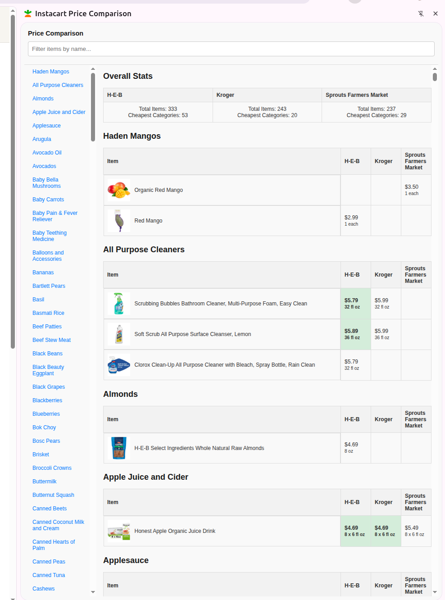

**WARNING** This is under development and it may not work at all in your machine.

# Instacart Chrome Extension

- "Load unpacked" this directory in chrome://extensions/

- Go to instacart.com page, login, and then click on the icon to open the extension sidepanel.

- Click on extension Options to select retailer names.

- The extension currently only displays previously bought items from the stores.

